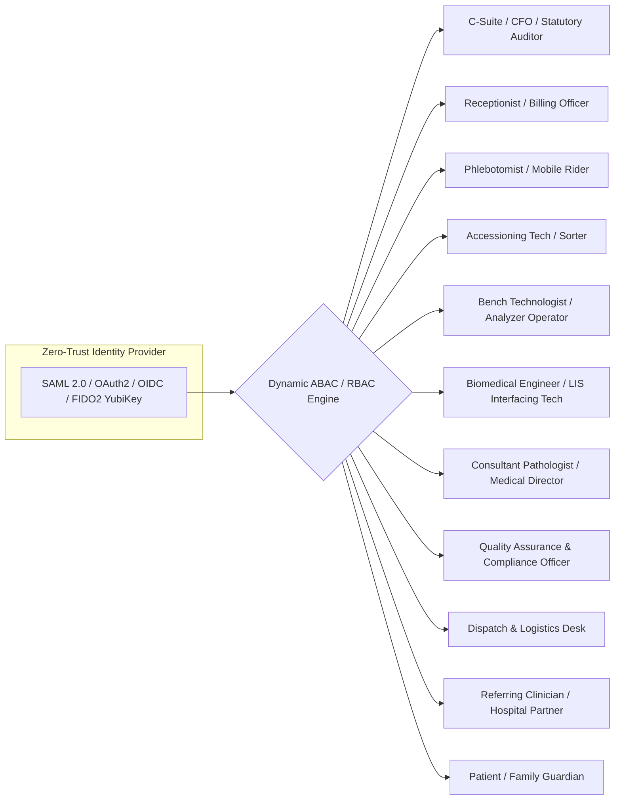
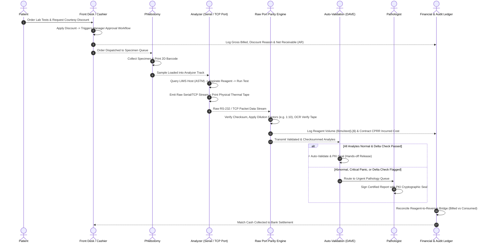
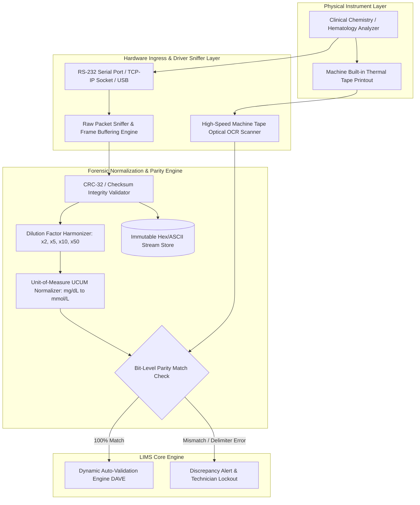
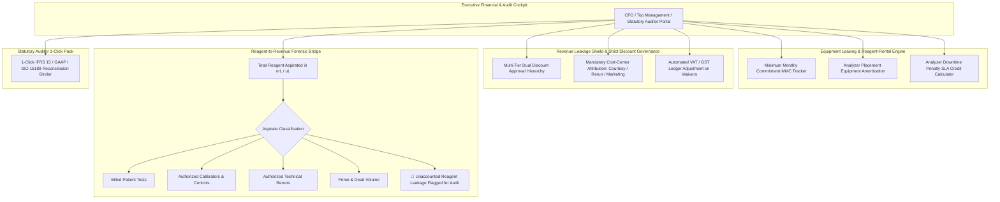
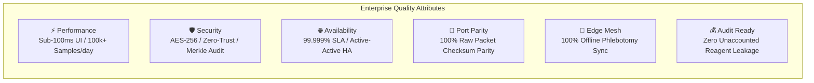
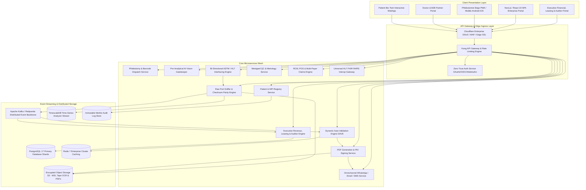
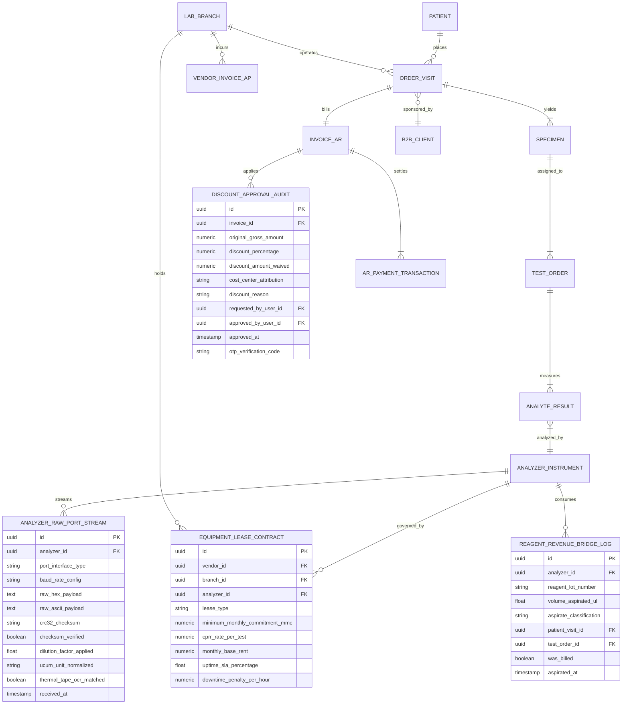
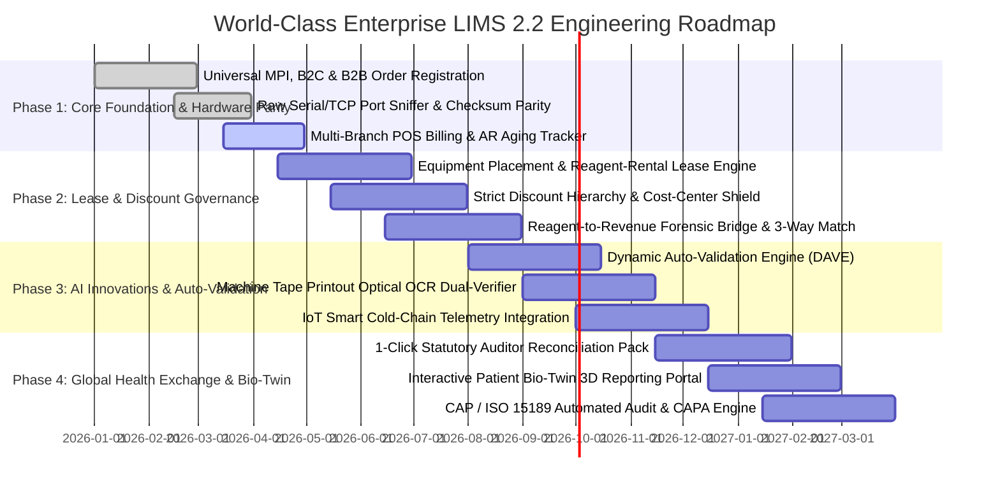

# Enterprise Product Requirements Document (PRD)
## Cybe: LabConnect — Autonomous, Forensically Reconciled & Intelligent Enterprise LIMS (v2.2)

---

| **Document Title** | Cybe: LabConnect — World-Class Next-Gen Enterprise Laboratory Information Management System |
| :--- | :--- |
| **Document Version** | 2.2 (Forensic Hardware Port Parity, Reagent-Rental Leasing & Revenue Leakage Shield) |
| **Status** | Approved for Global Engineering, Statutory Financial & Regulatory Architecture |
| **Target Deployments** | Standalone Diagnostics, Multi-Site Hospital Networks, Central Reference Hubs, Leased Vendor Consortia |
| **International Standards** | ISO 15189:2022, ISO 22870, ISO 17025, ISO 27001, CAP (LAP), CLIA '88, FDA 21 CFR Part 11, EU IVDR 2017/746, HIPAA/HITECH, GDPR (Art. 9), IFRS 15 / GAAP Revenue Recognition, ABDM (India), DHA/DoH (UAE) |

---

## 1. Executive Summary, Strategic Vision & Global Market Benchmark

### 1.1 Strategic Vision
To establish the gold standard for **autonomous, zero-error, forensically verifiable, and financially airtight clinical laboratory operations**. 

Traditional LIMS fail precisely where physical hardware meets financial accounting: **analyzer leasing/reagent-rental commitments are untracked, unbilled discounts and goodwill waivers create massive audit discrepancies, and serial port communication noise leads to dangerous mismatches between machine thermal printouts and final patient reports.**

LIMS 2.2 solves these systemic industry pain points by integrating:
1. **Hardware-to-Report Bit-Level Parity & Forensic Port Engine:** 100% checksum verification between raw RS-232/TCP analyzer feeds, thermal tape printouts, and finalized reports.
2. **Reagent-Rental Placement & Equipment Leasing Engine:** Automated tracking of Minimum Monthly Commitments (MMC), vendor equipment amortization, and downtime SLA credits.
3. **Revenue Leakage Shield & Strict Discount Governance:** Multi-tier dual-authorization, cost-center attribution for non-billed runs (reruns, QC, staff waivers), and automated Statutory Auditor Reconciliation packs (IFRS 15 / GAAP / ISO 15189).
4. **The Reagent-to-Revenue Bridge:** Forensic reconciliation matching physical reagent aspirated ($\text{mL} / \mu\text{L}$) against billed patient test volumes.

### 1.2 Global Market Benchmarking & Competitive Differentiation

```
                                  GLOBAL LIMS COMPETITIVE MATRIX
┌──────────────────────────────┬──────────────────┬─────────────────┬─────────────────┬──────────────────────┐
│ Capability / Dimension       │ Legacy LIMS      │ Modern Cloud    │ Hospital LIS    │ LIMS 2.2             │
│                              │ (LabWare/STARLIMS│ (Benchling)     │ (Epic Beaker)   │ (THIS SYSTEM)        │
├──────────────────────────────┼──────────────────┼─────────────────┼─────────────────┼──────────────────────┤
│ Core Focus                   │ QC & Biobanking  │ R&D / Biotech   │ Inpatient Care  │ End-to-End Diagnostic│
│ Port Stream Bit Parity       │ ❌ Basic Parsing │ ❌ None         │ ⚠️ HL7 Only     │ ✅ Raw Packet CRC32  │
│ Printout vs LIMS OCR Verify  │ ❌ Manual        │ ❌ None         │ ❌ None         │ ✅ Dual-Check OCR    │
│ Reagent-Rental Lease Mgmt    │ ❌ Manual ERP    │ ❌ None         │ ❌ None         │ ✅ Automated MMC     │
│ Reagent-to-Revenue Bridge    │ ❌ None          │ ❌ None         │ ❌ None         │ ✅ Live Vol vs Bill  │
│ Unaccounted Discount Shield  │ ⚠️ Plain Text    │ ❌ None         │ ⚠️ Basic Waiver │ ✅ Dual Auth + Ledger│
│ Auditor 1-Click Reconcile    │ ❌ Weeks of Work │ ❌ None         │ ⚠️ Complex RCM  │ ✅ IFRS/ISO 1-Click  │
│ Pre-Analytical AI Vision     │ ❌ Manual        │ ❌ None         │ ❌ Barcode only │ ✅ Vision HIL + Vol  │
│ Dynamic Auto-Validation      │ ⚠️ Basic Rules   │ ❌ None         │ ⚠️ Rule-Based   │ ✅ Bayesian + Rules  │
│ Cold-Chain IoT Telemetry     │ ❌ Manual Logs   │ ❌ None         │ ❌ None         │ ✅ Real-Time LoRa/BLE│
│ Sub-100ms Micro-UI UX        │ ❌ Dated Desktop │ ⚠️ Standard Web │ ⚠️ Complex Epic │ ✅ Instant Reactive  │
└──────────────────────────────┴──────────────────┴─────────────────┴──────────────────────┘
```

---

## 2. International Standards, Statutory Accounting & Regulatory Compliance

```mermaid
graph TD
    subgraph Regulatory, Metrology & Statutory Accounting Engine
        A[ISO 15189:2022<br/>Traceability & Competence] --> Core[LIMS Core Engine]
        B[CAP LAP & CLIA '88<br/>Proficiency & Calibration] --> Core
        C[FDA 21 CFR Part 11 / EU Annex 11<br/>Tamper-Evident Raw Data Ledger] --> Core
        D[IFRS 15 & US GAAP<br/>Revenue Recognition & Reagent Leases] --> Core
        E[Statutory Tax & Audit Engine<br/>VAT, GST, Cost-Center Disclosures] --> Core
        F[ASTM E1381/E1394 & CLSI LIS01-A2<br/>Hardware Port Protocol Parity] --> Core
        G[National HIE & Financial EDI<br/>X12 837/835, ABDM, Malaffi, Nabidh] --> Core
    end
```

### 2.1 Regulatory & Statutory Matrix

| Mandate / Standard | Regulatory Focus | LIMS 2.2 Forensic Technical Solution |
| :--- | :--- | :--- |
| **CLSI LIS01-A2 & ASTM E1381/E1394** | Serial/Network bit transmission integrity from analyzers | Raw packet buffering with CRC-32 checksums, frame delimiter verification (`<STX>`, `<ETX>`, `<CR>`, `<LF>`), and automatic baud rate parity handshakes. |
| **IFRS 15 / US GAAP** | Accurate revenue recognition, discount accounting, and embedded leases | Dual-ledger entry for every discount: Gross Billed vs Net Realized with mandatory Cost-Center liability allocation (e.g. *Marketing / Re-run / Clinical Courtesy*). |
| **Equipment Placement / Reagent Rental (Leasing)** | Accounting for capital equipment lent by OEMs (Roche/Sysmex/Abbott) | Real-time Minimum Monthly Commitment (MMC) tracking, per-test amortization calculation, and automated vendor invoice debit notes for downtime. |
| **FDA 21 CFR Part 11 & ISO 15189:2022** | Non-repudiation of analytical raw data | Raw hexadecimal and ASCII analyzer serial streams are hashed (SHA-256) and permanently stored in write-once audit storage before parsing. |
| **Statutory Tax & Audit Readiness** | Reconciling cash collections vs bills vs reagent consumption | 1-Click Auditor Pack proving zero unbilled sample runs, tracking every milliliter of reagent to a valid billing entry or authorized non-billable reason. |

---

## 3. User Personas & Role-Based Access Control (RBAC)



### 3.1 Granular Role Matrix & Permissions

| Role | Access Scope | Authentication Level | Core Functionalities |
| :--- | :--- | :--- | :--- |
| **CFO / Financial Controller / Auditor** | Executive Financial, AR/AP, Leases & Audit Packs | MFA + Hardware FIDO2 | Multi-branch P&L, Reagent-Rental lease tracking, unbilled discount audits, 3-way cash reconciliation, statutory audit exports. |
| **Biomedical / LIS Interfacing Engineer** | Serial Ports, Drivers & Parity Sniffers | MFA + Hardware Security Key | Port configuration (Baud rate, parity, stop bits, TCP socket), CRC checksum inspection, machine raw thermal printout OCR pairing. |
| **Receptionist / Cashier** | Front-Desk & Billing Modules | Password + SMS/App TOTP | UHID search/creation, B2C walk-in registration, corporate B2B roster upload, multi-mode POS billing, receipt generation. |
| **Bench Technologist** | Analytical Instruments & Worklists | Hardware Security Token / RFID | Instrument batch loading, calibrator/control runs, manual result entry, reflex testing triggers, rerun initiation. |
| **Consultant Pathologist** | Diagnostic Authorization & Review | FIDO2 Hardware Key / WebAuthn | Multi-parameter review, historical delta check analysis, critical panic override, cryptographic PKI report authorization. |
| **QA / Lab Director** | System-Wide Analytics & Quality | MFA + Dual Approval for Config | Westgard rule tuning, CAP/ISO audit export, staff competency sign-off, TAT bottle-neck diagnostics, revenue analytics. |

---

## 4. End-to-End Autonomous Diagnostic & Forensic Financial Workflow



---

## 5. Detailed Functional Specifications & Sophisticated Innovations

### 5.1 Module 1: Unified Omni-Channel Registration & Master Patient Index (MPI)
* **Global Master Patient Index (MPI / UHID):**
  * Deterministic and probabilistic fuzzy-matching engine (Levenshtein distance, Soundex, Dob/Phone/UID hashing) to eliminate duplicate patient records.
  * International ID Adapters: US SSN/MRN, India ABHA ID (ABDM Milestone 1-3 M1/M2/M3), UAE Emirates ID, UK NHS Number, Saudi Iqama/National ID.
* **Prescription & Document AI OCR:**
  * Gemini multimodal engine reads handwritten clinical doctor prescriptions, maps colloquial drug/test names to standard LOINC/CPT test codes, and pre-populates order forms with $>96\%$ accuracy.
* **Corporate & B2B Partner Portal:**
  * Bulk roster ingestion (XLSX, CSV, FHIR ServiceRequest JSON) for employee annual health checks with instant eligibility validation.
  * Custom contract pricing tiers, credit-limit enforcement, corporate consolidated invoicing, and co-branded reporting.

---

### 5.2 Module 2: Pre-Analytical AI Vision Gatekeeper & Smart Phlebotomy
* **AI Vision Pre-Analytical Gatekeeper (PA-Gatekeeper):**
  * Integrated optical inspection at accessioning:
    * **Hemolysis, Icterus, Lipemia (HIL) Pre-Check:** Analyzes plasma/serum spectral hue from standard high-resolution camera feeds before placing tubes on reagent-heavy analyzers.
    * **Tube Fill-Volume & Meniscus Laser Scan:** Flags underfilled ($< 90\%$ minimum draw for Sodium Citrate coagulation tubes) or overfilled containers.
    * **Cap Color vs Test Panel Verification:** Confirms tube type (Lavender EDTA, Gold SST, Light Blue Citrate, Gray Fluoride) against ordered tests to prevent pre-analytical cross-contamination.
* **CLSI Order-of-Draw Guidance:**
  * Interactive UI displays color-coded sequence and required inversions (e.g. *Invert 8-10 times*) according to CLSI GP41 standards.
* **Real-Time Cold-Chain IoT Telemetry:**
  * Integration with BLE / LoRaWAN smart transport boxes. Logs live GPS, temperature ($2-8^\circ\text{C}, -20^\circ\text{C}, -80^\circ\text{C}$), and shock/vibration during transit.
  * Triggers automated sample rejection alerts if temperature excursions exceed stability thresholds.

---

### 5.3 Module 3: Bi-Directional Analyzer Gateway & Hardware Port Parity Engine



* **5.3.1 Raw Port Packet Sniffer & Bit-Level Checksum Validator:**
  * Native drivers supporting **RS-232 (DB9/DB25), TCP/IP Sockets, USB-to-Serial FTDI, and Virtual COM ports**.
  * Complete frame buffering handling ASTM E1381/E1394, CLSI LIS01-A2, and HL7 packet headers (`<STX>`, `<ETX>`, Frame Numbers, Checksum bytes, `<CR>`, `<LF>`).
  * Calculates real-time CRC-32 and longitudinal redundancy check (LRC). Drops corrupted frames and requests automated instrument re-transmission.
  * **Immutable Hex & ASCII Stream Archival:** Stores raw, unparsed hexadecimal telemetry for every analyzer run, fulfilling ISO 15189:2022 §7.3 raw data retention mandates for 10 years.

* **5.3.2 Automated Dilution Factor & Unit-of-Measure (UCUM) Harmonization:**
  * **Dilution Factor Engine:** Automatically detects when a technician marks a specimen as diluted (e.g., $1:10$ on elevated Serum Lipase or hCG) and multiplies the raw analyzer reading before reporting, preventing catastrophic 10x clinical misdiagnoses.
  * **UCUM Unit Normalizer:** Automatically harmonizes conflicting unit standards (e.g. Glucose in $\text{mg/dL}$ vs $\text{mmol/L}$, Calcium in $\text{mg/dL}$ vs $\text{mmol/L}$) based on destination hospital/clinic preferences without manual manual conversion errors.

* **5.3.3 Machine Thermal Printout vs LIMS Dual-Tape OCR Verification:**
  * Resolves the common laboratory problem where values printed directly by the analyzer’s thermal printer differ from the values displayed in LIMS due to baud rate glitches or truncation.
  * Mobile/Accessioning camera captures a quick photo of the analyzer’s thermal tape output; the OCR engine cross-checks every single analyte value against the ingested digital packet.
  * **Discrepancy Hard Lock:** If a single decimal point or character differs between the printout and the LIMS ingested data, the result is locked instantly with an urgent alert to the Chief Biomedical Engineer.

---

### 5.4 Module 4: Dynamic Auto-Validation Engine (DAVE) & Pathologist Co-Pilot
* **Multi-Layer Auto-Validation Pipeline:**
  * **Layer 1: Instrument Flags & Cal Checks** (Verifies analyzer alarm flags: e.g. substrate depletion, clot detected, optical drift).
  * **Layer 2: Biological Reference Intervals (RIs)** (Age, gender, pregnancy trimester, and ethnicity-specific limits).
  * **Layer 3: Historical Delta Checks** (Velocity of change against patient's previous historical baselines).
  * **Layer 4: Multivariate Physiological Correlation:**
    * *Anion Gap Sanity:* $[\text{Na}^+] - ([\text{Cl}^-] + [\text{HCO}_3^-])$ checked against reference ($8\text{--}16\text{ mmol/L}$).
    * *Osmolal Gap Calculation:* Measured vs Calculated serum osmolality.
    * *MCHC-Coulter Sanity:* $\text{MCHC} = (\text{Hb} / \text{HCT}) \times 100$; flags cold agglutinins or lipemia if $>36.5\text{ g/dL}$.
    * *R-Ratio for Liver Injury:* Calculates $(\text{ALT}/\text{ULN}) / (\text{ALP}/\text{ULN})$ to classify hepatocellular vs cholestatic patterns.
* **AI Pathologist Clinical Copilot:**
  * Automatically drafts clinical narrative interpretations for complex panels (e.g. *Pattern consistent with mixed dyslipidemia and mild microcytic hypochromic anemia; suggest Iron Profile & Hb Electrophoresis*).

---

### 5.5 Module 5: Levey-Jennings Quality Control & Metrology Management
* **Automated Westgard Multi-Rule Evaluation:**
  * Evaluates control runs in real-time against stored lot means and standard deviations:
    * $1_{3s}$ (Random error $\rightarrow$ reject run)
    * $2_{2s}$ (Systematic error $\rightarrow$ reject run)
    * $R_{4s}$ (Random error across runs $\rightarrow$ reject run)
    * $4_{1s}$ (Systematic shift $\rightarrow$ maintenance warning)
    * $10_{\bar{x}}$ (Systematic bias $\rightarrow$ recalibration warning)
* **Moving Averages (Bull's Algorithm / $X_B$):**
  * Continuously evaluates rolling patient sample averages for hematology indices (MCV, MCH, MCHC) to detect subtle instrument calibration drift before QC failures occur.
* **Reagent RFID & Smart Shelf Management:**
  * On-board test countdown, expiration warning alerts, lot-to-lot parallel validation, and automated Purchase Order (PO) triggers.

---

### 5.6 Module 6: Point-of-Care Testing (POCT) & Remote Clinic Mesh (ISO 22870)
* **POCT Device Interoperability:**
  * Connects bedside glucometers, blood gas analyzers (ABG), handheld troponin readers, and urine dipstick readers via Bluetooth/Wi-Fi.
* **Operator Competency Enforcement:**
  * LIMS restricts POCT device operation unless the nurse/technician has an active ISO 22870 competency certification recorded in the system.
* **Central Quality Supervision:**
  * Lab Director monitors POCT quality control runs across all emergency departments, ICUs, and satellite clinics from a single unified dashboard.

---

### 5.7 Module 7: Executive Revenue, Leasing, AR/AP & Auditor Reconciliation Cockpit



* **7.1 Equipment Placement, Reagent-Rental & Analyzer Leasing Engine:**
  * **Context:** Modern laboratories rarely purchase analyzers outright; OEMs (Roche, Abbott, Sysmex) place equipment on **Reagent-Rental / Cost-per-Reportable-Result (CPRR)** contracts tied to Minimum Monthly Commitments (MMC).
  * **Minimum Monthly Commitment (MMC) Tracker:**
    * Continuously monitors contracted test minimums vs actual test runs across every leased analyzer in every facility.
    * Generates automated predictive alerts before month-end if a lab is falling behind on MMC, enabling workload re-routing from overloaded central labs to underutilized leased satellite analyzers.
  * **Analyzer Placement Amortization & Total Cost of Ownership (TCO):**
    * Calculates true per-test cost by amortizing equipment lease value, service contract (AMC/CMC) fees, electricity consumption, and consumable costs.
  * **Analyzer Downtime SLA Penalty Calculator:**
    * Tracks equipment downtime down to the exact minute.
    * If an OEM fails their $98.5\%$ uptime SLA, the system automatically computes contractually mandated penalty deductions and generates ready-to-issue Debit Notes against the vendor’s monthly invoice.

* **7.2 Revenue Leakage Shield & Strict Discount Governance:**
  * **Context:** Unaccounted discounts, verbal waivers, and unrecorded goodwill test runs create major revenue leakage, cash drawer imbalances, and statutory audit failures.
  * **Multi-Tier Dual Approval Hierarchy:**
    * Front-Desk Cashiers: Allowed discount $\le 5\%$ (with dropdown reason).
    * Lab Manager: Allowed discount $\le 20\%$.
    * CFO / General Manager: Mandatory digital sign-off via mobile OTP for any discount $> 20\%$ or $100\%$ full fee waiver.
  * **Mandatory Cost-Center Attribution for Non-Billed Runs:**
    * Every $0.00$ billed or discounted test run **must be assigned to a specific financial cost center**:
      1. *Clinical Technical Rerun (Pre-analytical failure)*
      2. *Physician Professional Courtesy (Marketing/Doctor relationship)*
      3. *Employee / Staff Health Benefit*
      4. *Indigent / Charity Healthcare Fund*
      5. *Proficiency Testing / Research Run*
  * **Automated Tax & Audit Adjustment:**
    * Automatically generates corresponding debits and credits in the accounting ledger (adjusting output VAT/GST) to ensure total compliance with statutory revenue recognition rules (IFRS 15 / GAAP).

* **7.3 Reagent-to-Revenue Forensic Reconciliation Bridge:**
  * **Context:** Eliminates the classic auditor challenge: *"1,000 tests of Glucose reagent were consumed by the machine, but only 720 tests were billed on the invoice. Where did the remaining 280 tests go?"*
  * **Algorithmic Reagent Classification:**
    Every microliter ($\mu\text{L}$) of reagent aspirated by an analyzer is automatically mapped in real time to one of five categories:
    1. **Billed Commercial Tests** (Linked directly to a paid Patient Visit ID)
    2. **Calibrator & Quality Control Runs** (Linked to Westgard QC log)
    3. **Authorized Technical Reruns** (Linked to analyzer flag or sample clot incident)
    4. **Daily Start-up Prime & Machine Dead Volume** (Calculated based on manufacturer specs)
    5. **Unaccounted Leakage / Shrinkage** (Flagged immediately as a red discrepancy on the CFO dashboard)
  * Shrinkage $> 2\%$ automatically triggers an internal audit investigation ticket.

* **7.4 Statutory Auditor & 1-Click Financial Reconciliation Pack:**
  * **Three-Way Cash Reconciliation:**
    Automated reconciliation between:
    $$\text{Front-Desk Cashier Collections} \longleftrightarrow \text{POS Payment Gateway / Bank Deposits} \longleftrightarrow \text{LIMS Invoiced Receivables}$$
  * **1-Click Audit Binder Export:**
    Generates fully formatted Excel and PDF audit dossiers containing:
    * Reagent Inventory vs Billed Volume Bridge
    * Discount & Fee-Waiver Authorizations with User Timestamps
    * Leased Analyzer MMC Fulfillment Reports
    * Accounts Receivable (AR) & Accounts Payable (AP) Aging Ledgers
    * General Ledger export formatted for seamless ingestion into **SAP, Oracle NetSuite, Tally Prime, and QuickBooks**.

---

### 5.8 Module 8: Omnichannel Patient Experience & Dynamic Bio-Twin Reporting
* **Interactive Digital Health Report (Dynamic Bio-Twin):**
  * Replaces flat PDFs with responsive web-based interactive reports:
    * **Longitudinal Trend Visualizers:** Interactive charts showing multi-year biomarker trends (e.g. HbA1c, Lipid fractions, TSH).
    * **3D Anatomical Organ Health Overlay:** Highlights cardiovascular, renal, metabolic, and hepatic wellness zones based on results.
    * **Voice-Powered Multi-Lingual Narration:** AI audio summary explaining results in the patient's native tongue (English, Hindi, Arabic, Spanish, French, etc.).
* **Instant Secure Delivery Network:**
  * Official WhatsApp Business interactive message with OTP download.
  * Encrypted PDF with AES-128 password protection.
  * Automatic synchronization to patient electronic health records via HL7 FHIR DiagnosticReport API.

---

### 5.9 Module 9: Enterprise Multi-Site Governance & Accreditation Audit Suite
* **Central Hub-and-Spoke Logistics & Batch Manifests:**
  * Satellite collection centers scan tubes into transit bags $\rightarrow$ generates temperature-logged shipment manifests $\rightarrow$ central accessioning scans batch QR code to receive 100+ samples simultaneously.
* **Automated Accreditation Audit Pack (ISO 15189 / CAP):**
  * One-click generation of comprehensive audit inspection binders: temperature logs, maintenance records, calibration reports, proficiency testing results, and staff training logs.
* **Corrective and Preventive Action (CAPA) Workflow:**
  * Integrated non-conformance tracking with root-cause analysis (5-Whys, Ishikawa fishbone diagram), corrective action assignment, and verification sign-offs.

---

### 5.10 Module 10: Adaptive UI/UX & Micro-Design System
* **Sub-100ms Instant Reactivity:**
  * Optimistic UI updates with offline client-side caching.
* **Dynamic Multi-Theme System:**
  * Corporate Blue, Clinical Emerald, Indigo Elegance, High-Contrast Dark Mode, and OLED Night Mode for low-light lab environments.
* **Full Multi-Lingual & Bidirectional (RTL/LTR) Support:**
  * Seamless switching between English, Hindi, Arabic (complete RTL layout mirroring), French, and Spanish.

---

## 6. Non-Functional Requirements (NFRs) & Global SLAs



### 6.1 Performance, Port & Financial Latency Benchmarks
* **Raw Port Packet Ingestion Latency:** Serial/TCP port packets processed, checksummed, and normalized within $< 25\text{ ms}$.
* **Thermal Printout OCR Verification Speed:** Mobile image OCR cross-checked against LIMS memory within $< 400\text{ ms}$.
* **Financial Ledger Update Latency:** AR and AP balance updates reflect across all executive dashboards within $< 100\text{ ms}$ of transaction capture.
* **Throughput Capacity:** Support $> 100,000$ test orders per day across distributed multi-hub setups.

### 6.2 Security, Privacy & Cyber Resilience
* **Zero-Trust Network Architecture (ZTNA):** All inter-service communications authenticated via mutual TLS (mTLS) with ephemeral JWT tokens.
* **Immutable Audit Ledger:** Database change capture (CDC) streaming into a tamper-evident write-once Merkle tree ledger, ensuring FDA 21 CFR Part 11 non-repudiation.
* **Financial Data Security:** Full PCI-DSS compliance for payment card processing, SOC 2 Type II audit certification.

### 6.3 Reliability, High Availability & Disaster Recovery
* **Availability SLA:** $99.999\%$ (Five Nines) uptime across multi-region active-active clusters.
* **Disaster Recovery Targets:**
  * **Recovery Point Objective (RPO):** $0\text{ seconds}$ (synchronous transactional replication).
  * **Recovery Time Objective (RTO):** $< 60\text{ seconds}$ (automated regional DNS failover).
* **Offline Edge Resilience:** Local SQLite / IndexedDB mesh on phlebotomy tablets allows continuous registration, collection, and barcode printing without active internet; seamlessly merges via CRDT (Conflict-Free Replicated Data Types) upon reconnection.

---

## 7. System Architecture & Technical Specifications



---

## 8. Master Entity-Relationship & Relational Data Schema



---

## 9. Phased Global Engineering & Deployment Roadmap



---

## 10. Quantitative Success Metrics & Financial ROI Scorecard

| Dimension | Target Metric / KPI | Industry Baseline | LIMS 2.2 Target |
| :--- | :--- | :--- | :--- |
| **Port-to-Report Data Parity** | Mismatch between raw machine tape and LIMS | $0.5\% - 1.2\%$ errors | $\mathbf{0.000\%}$ via bit CRC32 + OCR |
| **Unaccounted Reagent Leakage** | Wasted reagent vs billed patient test count | $14\% - 22\%$ leakage | $\mathbf{\le 1.0\%}$ forensic reconciliation |
| **Unaccounted Discount Write-offs**| Revenue lost to unrecorded verbal fee waivers | $3.8\%$ of gross billings | $\mathbf{0.00\%}$ via dual-auth shield |
| **Leased Analyzer MMC Penalty Avoidance** | Losses from failing vendor volume minimums | $\$45\text{k} - \$120\text{k}/\text{yr}$ | $\mathbf{\le \$0.00}$ via workload re-routing |
| **Statutory Audit Preparation**| Time required for ISO 15189 / Financial audit | $3\text{ weeks}$ manual collation | $\mathbf{1\text{ click}}$ instant compilation |
| **Days Sales Outstanding (DSO)** | Average collection timeline for AR accounts | $55\text{--}68\text{ days}$ | $\mathbf{\le 32\text{ days}}$ ($-50\%$) |
| **Operational Turnaround (TAT)** | Routine Outpatient Panel TAT (CBC / BMP) | $180\text{ minutes}$ | $\mathbf{\le 45\text{ minutes}}$ ($-75\%$) |
| **Pre-Analytical Accuracy** | Sample Rejection Rate due to Clots/QNS/HIL | $1.8\% - 2.5\%$ | $\mathbf{\le 0.12\%}$ ($-95\%$) |
| **Automation Velocity** | Auto-Validation Rate for Normal Runs | $20\% - 35\%$ | $\mathbf{80\% - 85\%}$ hands-off release |

---

## 11. Conclusion & Authorization
This Product Requirements Document establishes the definitive global blueprint for an autonomous, forensically verified, and financially airtight Laboratory Information Management System. By eliminating the systemic points of failure between serial hardware communication, equipment placement leasing, unaccounted discounts, and statutory accounting audits, LIMS 2.2 transforms diagnostic laboratories into world-class, high-margin, and zero-error centers of clinical excellence.
