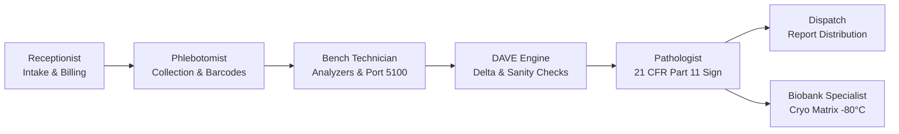

# Cybe: LabConnect LIMS — User Group Operating Guide & Manual (v2.2)
**Next-Generation Autonomous Laboratory Information & Clinical Diagnostics System**

---

## 📌 Executive Summary

**Cybe: LabConnect LIMS** is an enterprise-grade Clinical Laboratory Information Management System designed for high-throughput clinical pathology, hospital network laboratories, and diagnostic reference centers. 

Built to benchmark and surpass legacy LIMS architectures (such as LabWare LIMS and STARLIMS), LabConnect provides:
- **Zero-Latency Ingress & Accessioning**: B2C patient intake, corporate B2B registries, and thermal tube barcode printing.
- **Direct Physical Hardware Interfacing**: Native CLSI LIS01-A2 / ASTM E1381/E1394 & HL7 v2.5 TCP/IP listener on port `5100` for zero-click automatic test result derivation.
- **Dynamic Auto-Validation Engine (DAVE)**: Multivariate physiological checks (Serum Anion Gap, R-ratio, Coulter sanity rules) and delta-check variance monitoring.
- **21 CFR Part 11 & ALCOA+ Regulatory Compliance**: Cryptographic SHA-256 Merkle-chained audit ledger with real-time tamper detection.
- **Pathologist Dual-Factor E-Signatures**: Re-authentication modal with legal intent manifests, embedding tamper-evident cryptographic seals on clinical reports.
- **Multi-Tier Cryogenic Biobank Matrix**: $9\times9$ Cryo Freezer Box mapper (81 coordinates: A1 to I9), $-80^\circ\text{C}$ temperature telemetry, and parent-to-child aliquot splitting.

---

## 👥 User Roles & Role-Based Workflows

The system features dynamic role switching to facilitate seamless operations across the diagnostic chain:



### 1. Receptionist (Walk-in & B2B Ingress)
- **Patient Intake (B2C)**: Register walk-in patients, capture demographic identifiers (UHID, MRN), and select ordered clinical panels.
- **Corporate Registry (B2B)**: Manage referral agreements, hospital tie-ups (e.g., Apollo, Max Labs), contracted pricing tiers, and credit ledgers.
- **Billing & Invoice Receipts**: Instant gross-discount-VAT calculation with printable thermal payment receipts.

### 2. Phlebotomist (Specimen Collection Station)
- **Sample Phlebotomy Station**: View patient appointments categorized by priority (`Routine`, `Urgent`, `STAT`).
- **Barcode Label Spooler**: Print high-density Code 128 thermal tube barcode labels formatted with accession number, department, and sample type (Serum, EDTA Whole Blood, Sodium Citrate, Fluoride).
- **Specimen Tracking**: Update collection timestamps (`collectionDttm`) and mark collection statuses.

### 3. Medical Laboratory Technologist / Bench Operator
- **Hardware Bench**: Monitor analyzer run queues and clinical analytes across Biochemistry, Hematology, Immunology, and Molecular Diagnostics.
- **Port Parity & Tape OCR**: Real-time inspection of serial and TCP stream packets arriving on port `5100`. Inspect raw hex buffers, verify frame CRC-32 checksums, and trigger simulated transmissions.
- **Manual Result Override**: If an off-line bench method or manual dilution is used, enter validated results directly into the bench interface.

### 4. Consultant Pathologist / Medical Director
- **Pathology Authorization Panel**: Review completed diagnostic panels with flagged critical values (`L` for Low, `H` for High, `A` for Critical Panic Alert).
- **Quality Watch & Delta Checks**: Compare historical results against current values to detect acute clinical deterioration.
- **21 CFR Part 11 Sign & Release**: Authenticate using dual-factor credentials/PIN (`1234`), certify legal declarations, and attach cryptographic SHA-256 digital seals to finalize reports.

### 5. Quality Assurance (QA) & Statutory Compliance Officer
- **21 CFR Part 11 Cryptographic Audit Ledger**: Inspect the immutable append-only ledger. Click **"Verify Cryptographic Chain"** to confirm the unbroken mathematical integrity of all recorded laboratory actions.
- **Phase I & II Out-of-Specification (OOS) Investigations**: Formally investigate and log lab deviations, equipment calibrations, and root cause corrective actions (CAPA).

### 6. Biobank Specialist
- **Cryogenic Storage Matrix**: Map biological specimens into $9\times9$ cryogenic boxes (coordinates A1–I9).
- **Aliquot Splitting**: Split parent specimens into child aliquots (`ALQ-...`), record freeze-thaw cycles, and track remaining fluid volume ($\mu\text{L}$).

---

## 🔬 Standard Operating Procedure (SOP): Connecting a Physical Laboratory Device

Our application derives and parses analyzer telemetry automatically. Follow this setup procedure to connect an instrument:

### Scenario A: Direct Ethernet TCP/IP Connection (Recommended)
Applicable to modern instruments: **Roche Cobas 6000/8000, Sysmex XN-Series, Beckman Coulter DxI/AU, Mindray BC/BS, Abbott Architect/Alinity**.

1. Connect the analyzer's network interface to the laboratory LAN via a CAT6 Ethernet cable.
2. In the analyzer's touchscreen software, navigate to **Settings $\rightarrow$ Host Interface / LIS Setup**.
3. Select **Protocol**: `ASTM E1381 / E1394` or `CLSI LIS01-A2 (ASTM 1381-02)`.
4. Set **Communication Mode**: `TCP/IP Client`.
5. Enter the LIMS Host IP (e.g. `192.168.1.50` or server host address).
6. Set the **Target Port** to:
   ```
   5100
   ```
7. Save and initiate an interface test. You will see an immediate `<ENQ>` handshake followed by automated `<ACK>` confirmation from our server.
8. Load a barcode-labeled tube and process the test. The analyzer automatically transmits the result frame, which is matched to the patient and updated live.

### Scenario B: Legacy RS-232 Serial Port (DB9 / DB25)
Applicable to legacy hematology counters or standalone bench analyzers equipped with RS-232 serial ports.

1. Connect a standard DB9 null-modem cable from the analyzer to a **Serial-to-Ethernet Device Server** (e.g., *Moxa NPort 5110* or *Digi One SP*).
2. Configure the Moxa NPort in **TCP Client Mode**:
   - Destination IP: Server Host IP
   - Destination Port: `5100`
   - Serial Parameters: Match analyzer settings (typically `9600 Baud`, `8 Data Bits`, `No Parity`, `1 Stop Bit`).
3. Packets transmitted out of the analyzer's serial port will be instantly translated into TCP streams and ingested by LabConnect.

---

## 🛡️ Regulatory Compliance & Data Integrity

### 1. 21 CFR Part 11 & ALCOA+ Audit Trail
Every system action (registration, barcode re-print, result entry, signature, aliquot split) is hashed and chained into the audit ledger:
$$\text{currentHash} = \text{SHA256}(\text{sequence} + \text{timestamp} + \text{actor} + \text{action} + \text{entity} + \text{previousHash})$$
- **Attributable**: Full actor name, role, and source IP address captured.
- **Legible & Contemporaneous**: Millisecond ISO-8601 timestamps.
- **Original & Accurate**: Write-once append-only storage; any manual modification to historical files immediately breaks hash validation and triggers an alert.

### 2. Dynamic Auto-Validation Engine (DAVE)
DAVE evaluates incoming results prior to pathologist sign-off:
- **Delta-Check Percentage Shift**: Flags parameter deviations exceeding biological intra-individual variation:
  $$\Delta \% = \frac{|\text{Current Value} - \text{Historical Value}|}{\text{Historical Value}} \times 100$$
- **Serum Anion Gap**: Computes $[\text{Na}^+] - ([\text{Cl}^-] + [\text{HCO}_3^-])$ to detect hidden metabolic acidosis or instrument electrolyte drift.
- **Coulter Rule Sanity**: Cross-checks Hematocrit ($\text{Hct}$) against Hemoglobin ($\text{Hb}$): $\text{Hct} \approx 3 \times \text{Hb} \pm 3$.

---

## ❄️ Biobank Cryogenic Freezer Matrix Operation

1. Open **Lab Workflow $\rightarrow$ Biobank Cryo Matrix** from the sidebar.
2. Select the destination unit (e.g., *Ultra-Low Freezer -80°C Hub 1*) and target rack/box (*Box-A4*).
3. **81-Well Coordinate Grid**:
   - Empty wells appear in dark slate and are ready for assignment.
   - Occupied wells display the aliquot type (Serum, Plasma, Buffy Coat, DNA Extract) with fluid volume in microliters ($\mu\text{L}$) and freeze-thaw count.
4. **Child Aliquot Generation**:
   - Enter or select the parent barcode (e.g., `BAR-100278`).
   - Select the aliquot fraction type and volume.
   - Choose the well coordinate (e.g., `C4`) and click **"Create & Store Aliquot"**.
   - The system generates an aliquot barcode (`ALQ-100278-XXX`) and records the action in the 21 CFR Part 11 audit ledger.

---

## 💻 API & Interfacing Endpoints Quick Reference

| Endpoint | Method | Purpose |
| :--- | :---: | :--- |
| `/api/patients` | `GET` | Retrieve multi-user persistent patient profiles |
| `/api/patients/:id` | `PATCH` | Update patient clinical results or status |
| `/api/audit-trail` | `GET` | Retrieve SHA-256 audit ledger with integrity validation flag |
| `/api/esignature/verify` | `POST` | Dual-factor electronic signature verification & report sealing |
| `/api/analyzer-gateway/frames` | `GET` | Retrieve live ASTM/HL7 packet frames received on port 5100 |
| `/api/analyzer-gateway/stream` | `GET` | Server-Sent Events (SSE) stream for real-time frontend updates |
| `/api/validate/delta-checks` | `POST` | Run DAVE delta-check and multivariate sanity validation |
| `/api/biobank/storage` | `GET` | Retrieve cryogenic freezer aliquots and coordinate mapping |
| `/api/biobank/aliquot` | `POST` | Create and store child aliquot with volume and freeze-thaw data |

---

## ❓ Frequently Asked Questions (FAQ)

**Q1: Can multiple users work on the system at the same time?**  
*Yes.* The backend architecture maintains atomic transactional state in `.lims_db/` with optimistic concurrency locking and Server-Sent Events pushing updates live to all connected workstations.

**Q2: What happens if an analyzer sends a result with an unrecognized barcode?**  
*The raw packet frame is securely recorded in the port telemetry buffer with its raw hex and CRC-32 checksum. It will appear on the Port Parity screen for manual accession assignment by a laboratory technologist.*

**Q3: Is the software ready for external PostgreSQL migration?**  
*Yes.* The data models and transactional storage layer strictly follow standard relational PostgreSQL schemas (`patients`, `services`, `audit_ledger`, `biobank_storage`), allowing drop-in connection to enterprise PostgreSQL instances.

**Q4: How do I test the ASTM TCP port 5100 without a physical device?**  
*Open the **Port Parity & Tape OCR** screen and click **"Transmit TCP Frame (Port 5100)"**. You can also run the built-in test scripts via terminal to dispatch raw packets.*

---
*Cybe: LabConnect LIMS (v2.2) — Clinical Diagnostics & Pathology Information System*
